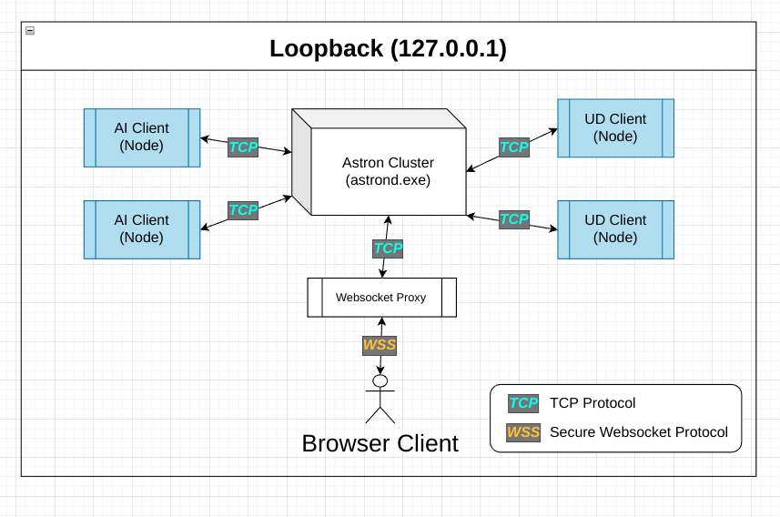
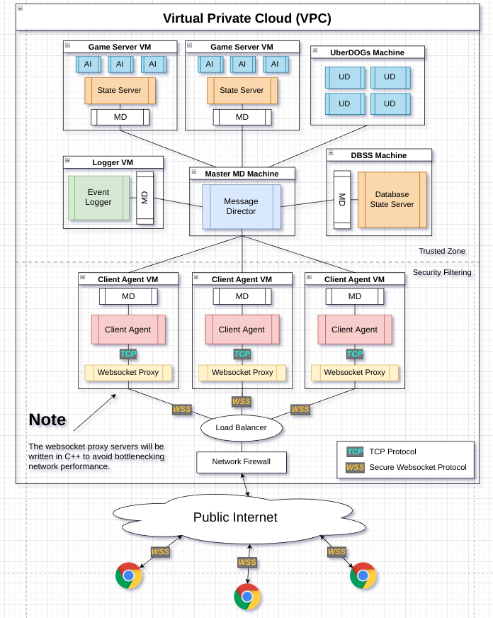

# libastron-js
An open source implementation of the Astron server Distributed Object system for Javascript clients that run on either a browser or on a NodeJS environment. Written in TypeScript.

This project is brand new, and for a very long time will not be complete by any means.

This is a long jump to create a javascript client for Astron that can run on both the browser and a Node environment. (Clients on browser running the ThreeJS 3D engine, and AI server-side Astron clients running on a NodeJS environment.)

**Note:** There is also the need of creating a fast proxy to bounce data from client secure websocket (WSS) connections over to TCP connections so that clients can reach the Astron client agent server.

# Development Environment Diagram
This is an abstract diagram; I have not replicated this environment, but it conveys the idea.

# Production Environment Diagram
This is an abstract diagram; I have not replicated this environment, but it conveys the idea.

